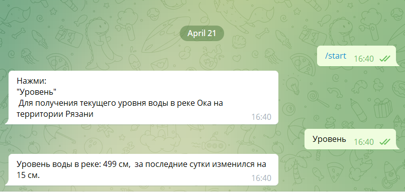

# water_level_of_the_Oka_river_bot
A simple telegram bot that shows the water level of the Oka River in the Ryazan city

# Supported docker tags

-   [vladkmrdnv/water_level_of_the_oka_river_bot:latest]((https://hub.docker.com/repository/docker/vladkmrdnv/water_level_of_the_oka_river_bot))

# How it works?

[]

## License

See [LICENSE](LICENSE.md)